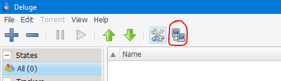
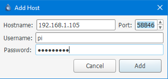
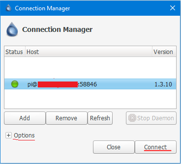

# Always on Torrent box with Deluge | Raspberry Pi
Often the torrent downloads take lots of time expecially on slow connections, in other cases you are a mantainer (of a distro for example) and you need to remain in seed all the time. Keep on your PC is a big energy waste.

For this reason I want to build a TorrentBox on the Raspberry Pi: you start the download from your PC as usually, but in the reality the torrent is put in download on your low-cost  microprocessor, so you can shut down the PC and the download will continue.

To do this we will use Deluge, a BitTorrent client where the daemon and the GUI are separated and can be in different computers. We will install the daemon on the Raspberry Pi and the GUI on our PC.

## Install and configure Deluge on Raspbian
1. Install deluge.
  ```bash
  sudo apt update
  sudo apt install deluged deluge-console deluge-web
  ```
2. Start and stop the deluge daemon and web (it will create the configuration file that we need).
  ```bash
  deluged && deluge-web &
  sudo pkill deluged && pkill deluge-web && fg
  ```
3. Edit the daemon config file.
  ```bash
  nano ~/.config/deluge/auth
  ```
  Add this new line at the end of the file.
  ```
  username:password:10
  ```
  Where username and password are those that allow us to connect with the GUI to the demon and 10 is the permissions level (10 = full access).  
  If you want you can add other line with other user with less permission, for example a level 5 user can add, remove and manage torrents, but can't modify the settings, level 1 can ponly see torrents status but neither add nor remove them.
  
  Save and exit with Ctrl+X, Y and enter.
4. Allow remote connections. Open the console:
  ```bash
  deluged && deluge-console
  ```
  Once the command line console is open enter these commands:
  ```bash
  config -s allow_remote True
  exit
  ```
5. Now restart the daemon.
  ```bash
  sudo pkill deluged && deluged && deluge-web &
  ```
6. Configure Deluge to **run on startup**.
  ```bash
  sudo nano /etc/default/deluge-daemon
  ```
  Put these rows at the end of the file:
  ```bash
  # Configuration for /etc/init.d/deluge-daemon
  DELUGED_USER="username"
  RUN_AT_STARTUP="YES"`
  ```
  changing `username` with the specified username.
7. Download the init file, set the right permissions and update the startup file.
  ```
  sudo wget -O /etc/init.d/deluge-daemon https://raw.githubusercontent.com/daquinoaldo/RaspberryPi/master/deluge/deluge-daemon
  sudo chmod 755 /etc/default/deluge-daemon && sudo chmod 755 /etc/init.d/deluge-daemon
  sudo update-rc.d deluge-daemon defaults
  ```
8. Reboot: `sudo reboot`.


## Install the GUI on our PC
Download the [latest Deluge version](http://dev.deluge-torrent.org/wiki/Download) and install on your system.

Once the install is finished open deluge and navigate to Edit > Preferences > Interface and remove the check in the Classic Mode check box. Apply the preferences and restart the program.

At the start you can see the Connection Manager mask. If not click on this button.  


In the connection manager click on add. Now you should see this panel.  


Insert in the hostname the IP address of your Raspberry Pi (you can find id typing ifconfig on the Pi terminal), and the username and password those who you chose before. Don't change the port. Clicking Add if everything go right you can see a green semaphore next to the connection.  


Select it and connect. If you want expanding the "Options" you can check "Automatically connect to selected host on start-up" and "Do not show this dialog on start-up".


## Connect via Web page:
Go to http://raspberrypi.local:8112 (or your Raspberry Pi IP). The default password is "deluge". Change it in Preferences > Interface > Password.
